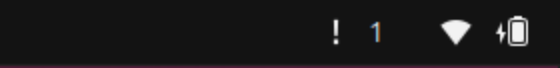
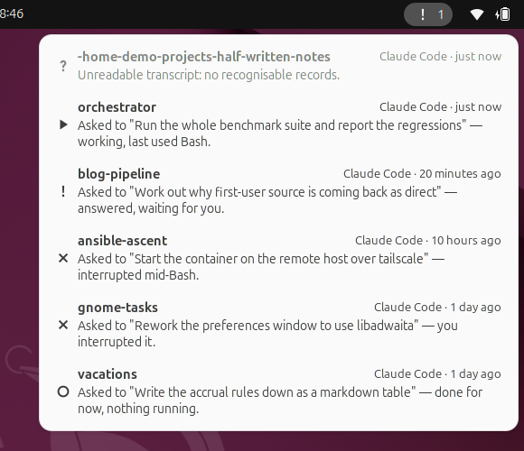
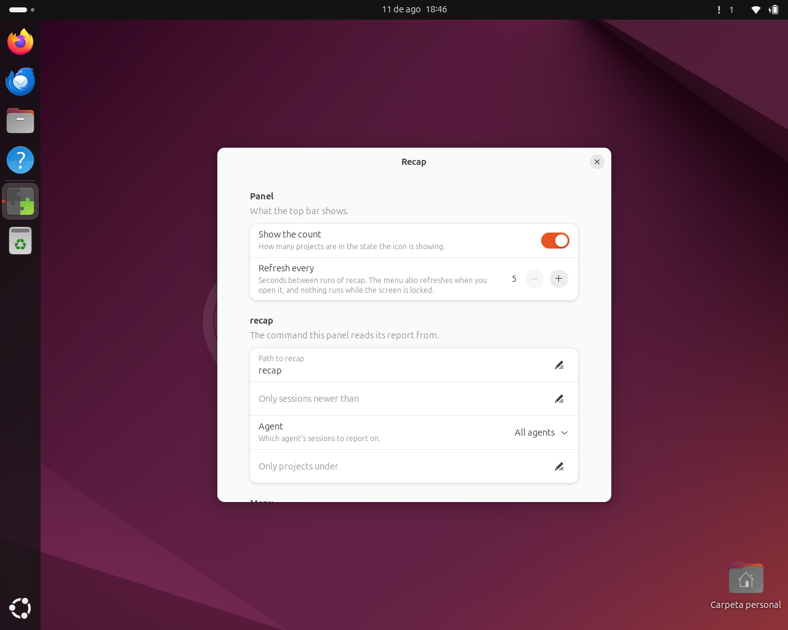

# recap for GNOME Shell

Your coding agents are working in six directories at once. One of them stopped ten minutes
ago to ask you a question, and you have no idea which. This puts the answer in the top bar.

```sh
curl -fsSL https://raw.githubusercontent.com/gortazar/recap-gs/main/install.sh | sh
```

Then log out and back in, and the indicator appears. It needs
[`recap`](https://github.com/gortazar/recap) on your `PATH` — that is where the report comes
from — and says so plainly if recap is not installed.



The icon is the most urgent thing happening and the number is how many are in that state, so
"something is waiting for you" is visible without opening anything. Open it for the list:



One row per project, newest first, each with recap's own one-sentence account of what that
session was asked and where it got to. **Click a row and the session resumes** — a terminal
opens in the directory that session was running in, and `claude --resume` (or
`opencode --session`) picks it up where it stopped.

## What it shows

The vocabulary is recap's, and this extension decides none of it: it reads `recap --json`
and draws what it says.

| | Status | What it means |
|---|---|---|
| exclamation mark | **waiting** | stopped and waiting for you: a question, an answer, or a permission prompt |
| play triangle | **running** | an agent is working in that directory right now |
| cross | **interrupted** | not running, and the transcript ends mid-work — the closed-the-laptop case |
| question mark | **unclear** | recap could not tell: an unreadable transcript, or no way to check what is running |
| hollow circle | **idle** | not running; it stopped at an ordinary point |
| tick | **finished** | ended after explicitly completing what it was asked |

Those are the same six states recap prints as 🟡 🟢 🔴 ❓ ⚪ ✅ in a terminal; the panel draws
them as symbolic icons instead, so they follow your icon theme and your light/dark
preference. The mapping is spelled out in both directions in
[`docs/recap-json-contract.md`](docs/recap-json-contract.md).

**waiting outranks running** wherever one icon has to stand for several sessions. A running
agent needs nothing from you; a waiting one is the reason to look.

## Preferences



Refresh interval, the path to recap, which of recap's filters to pass (`--since`, `--agent`,
project roots), whether to show the count, whether to list finished and idle sessions, and
which terminal to open when you click a row.

## What it does not do

- **It never reads a transcript.** recap owns every rule about what a session's state is; two
  implementations of that would eventually disagree, and then the panel and the terminal
  would be telling you different things about the same session.
- **It never blocks the shell.** recap is run through `Gio.Subprocess` with
  `communicate_utf8_async`, with a timeout that cancels the run *and* kills the child. A slow
  or hung recap leaves the last report on screen, labelled with its age.
- **It does not poll behind your back.** Refreshes stop while the screen is locked or the
  session has been idle for five minutes, and resume the moment you come back.
- **It does not notify.** It is a readout you look at, not a thing that interrupts you. (See
  the open question about this in the idea's plan.)
- **It never writes to an agent's state.** The only thing it starts is the terminal you asked
  for by clicking a row.

## Requirements

- GNOME Shell 46, 47, 48, 49 or 50.
- [`recap`](https://github.com/gortazar/recap) on your `PATH` (or its path set in
  preferences). Without it the extension installs and runs perfectly happily, and the menu
  tells you what is missing.

## Development

```sh
nix develop            # gjs, eslint, glib, the packer
gjs -m tests/run.js    # the headless suite: 147 tests, no compositor needed
nix flake check        # lint + that suite + a --strict schema compile + the upload zip
nix build              # the packed .shell-extension.zip
```

Everything with a decision in it lives in [`src/lib/`](src/lib), which imports only GLib and
Gio — no `St`, no `resource:///org/gnome/shell`. That is what makes the suite above possible:
decoding, the status vocabulary, the row model, the panel summary, error classification, the
refresh schedule and the resume command lines are all tested under plain `gjs`.
[`src/extension.js`](src/extension.js) is creation and destruction and nothing else.

Two things the suite cannot ask, so a script does instead:

```sh
ci/smoke-test.sh                  # boot a real headless shell and load the extension into it
scripts/screenshot.sh             # the same run, with the pictures above taken from it
scripts/install-local.sh          # install the working tree for a hand-try
scripts/record-fixtures.sh        # re-record tests/fixtures from the real recap binary
```

`ci/smoke-test.sh` starts a headless GNOME Shell with a throwaway `HOME` of its own, lets it
load the extension out of `enabled-extensions` the way a session would, checks that the panel
button appears and its menu fills from a real subprocess, then enables and disables the
extension five times and asserts that nothing is left attached to the main loop. It touches
neither your session nor your dconf.

It is not in CI: GitHub's runners have no GNOME Shell, and installing one plus a virtual
monitor to run it is a much bigger dependency than the thing it checks. Run it by hand before
a release.

## The contract with recap

`recap --json` is a versioned public interface, and this extension is written against
**schema version 1**. A report at any other version is refused with a message saying so,
rather than rendered on a guess. [`tests/fixtures/`](tests/fixtures) holds recorded output
from the real binary — every status, an empty report, an unreadable session, and a machine
with no process table — and `docs/recap-json-contract.md` says what version 1 guarantees and
what happens when it is broken.

## Licence

GPL-2.0-or-later, like GNOME Shell itself. See [LICENSE](src/LICENSE).
